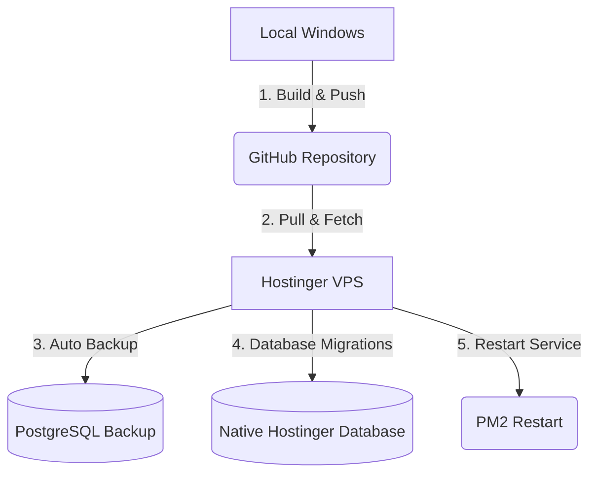

# VaxPlan VPS Deployment & Database Migration Guide

This guide details the complete deployment process from the local Windows environment, pushing to GitHub, pulling on the Hostinger VPS, and executing the deployment/build scripts with automatic database backups.

---

## Deployment Process Overview



---

## Step 1: Pushing Changes from Localhost (Windows)

All changes are committed and deployed using the `fix-line-endings` branch.

1. **Rebuild the production assets locally**:
   ```powershell
   npm run build
   ```
2. **Commit and push your changes**:
   ```powershell
   git add .
   git commit -m "chore: standardise configuration and update build"
   git push origin fix-line-endings
   ```

*(Alternatively, you can run `npm run deploy:local` which automates compiling and pushing built files to git).*

---

## Step 2: Database Migration & Backup

Our deployment scripts now automatically run a database backup (`pg_dump`) before code pulling and database schema updates.

### Option A: Standard Deployment (Fast & Clean)
If you only have code updates and safe additive migrations, run this on the VPS:
```bash
# SSH into Hostinger VPS and navigate to code directory
cd /var/www/vaxplan

# Fetch branch, reset local state, and deploy
git fetch origin
git checkout fix-line-endings
git reset --hard origin/fix-line-endings

# Runs pg_dump backup, installs prod dependencies, runs migrations, and restarts PM2
bash scripts/deploy-vps.sh
```

### Option B: Fresh Setup & Database Migration (From Localhost to VPS)
To copy your entire local development database from your local machine to the VPS:

1. **Dump the local database on Windows**:
   ```powershell
   # In local Windows PowerShell
   pg_dump -U postgres -d vaxplan -f local_dump.sql
   Compress-Archive -Path local_dump.sql -DestinationPath local_dump.sql.zip -Force
   ```
2. **Transfer the backup file to the VPS**:
   ```powershell
   # In local Windows PowerShell
   scp local_dump.sql.zip root@72.60.233.213:/var/www/vaxplan/
   ```
3. **Execute the Deploy and Restore script on the VPS**:
   ```bash
   # In your Hostinger VPS Terminal
   cd /var/www/vaxplan
   git fetch origin
   git reset --hard origin/fix-line-endings
   
   # Unzips, creates a backup of the current state, imports the local dump, and starts PM2
   bash scripts/vps-setup/deploy-and-restore.sh
   ```

### Option C: Deployment with Safe Upsert/Seeding
To deploy new code, create a backup, sync the database schemas, and seed operational default records:
```bash
# In your Hostinger VPS Terminal
cd /var/www/vaxplan
git fetch origin
git reset --hard origin/fix-line-endings

# Backs up, pulls, builds, runs migrations, seeds, and restarts PM2
bash scripts/vps-setup/deploy-and-upsert.sh
```

---

## VPS Database Connection Configuration

Ensure that `/var/www/vaxplan/.env` on the VPS is pointing to your native Hostinger PostgreSQL database credentials:
```env
DATABASE_URL=postgresql://<db_user>:<db_password>@localhost:5432/<db_name>
```
*All CJS database migration scripts automatically parse the `DATABASE_URL` from this file.*
